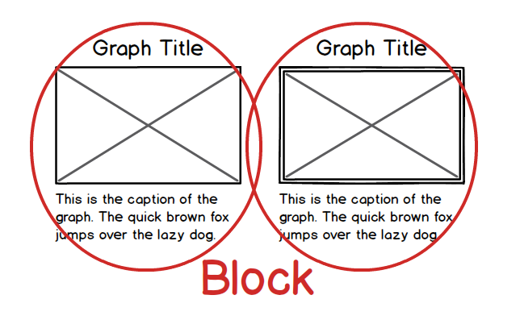
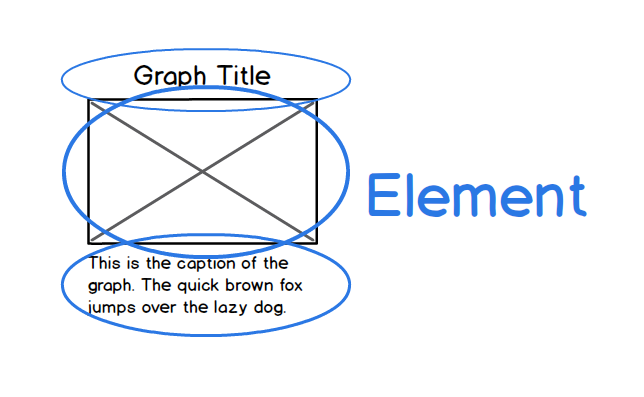
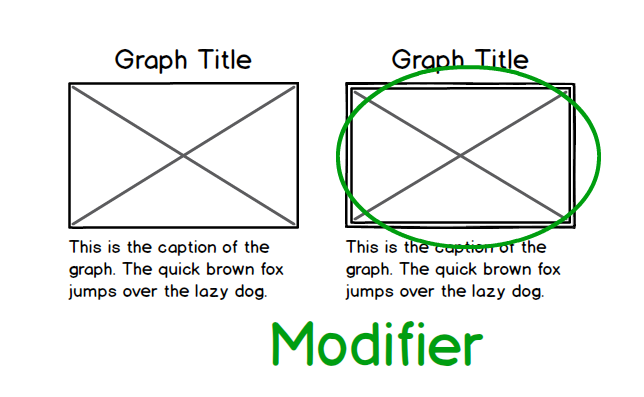

# HTMLテンプレートの設計

高津戸 壮 \[[@Takazudo](https://twitter.com/Takazudo)\]

----

## 自己紹介

* 高津戸 壮（たかつど たけし）
* [株式会社ピクセルグリッド](http://www.pxgrid.com/)
* フロントエンドエンジニア
* [@Takazudo](twitter.com/Takazudo)

---

<div class="my-img"></div>

----

<ul class="bigList">
<li>OOCSS</li>
<li>BEM</li>
<li>SMACSS</li>
</ul>

----

<h1 style="font-size:4em">OOCSS</h1>

----

## OOCSSとは

* Object Oriented CSS
* Nicole Sullivan (YAHOO!)
* オブジェクト指向っぽく考えて整理しよう
* レゴみたいに組み合わせてページをつくろう

----

## こういうのがダメ

---

<div class="my-img"></div>

---

```
#main h2 {
  ...
}
#main .contact .header h2 {
  ...
}
#sidebar h2 {
  ...
}
```

場所の名前に依存してスタイルを当てる

----

## なぜダメか？？

---

### 上書き合戦


---

### コピー


---

### 詳細度


---

### !important


---


ごちゃごちゃに & 容量増加


----

## レゴみたいに考える

---

<div class="my-img"></div>

---

### 一つ一つの部品に名前をつける

<div class="my-img"></div>

---

```
.heading {
  ...
}
.heading2 {
  ...
}
.heading3 {
  ...
}
.heading4 {
  ...
}
```

レゴの部品: CSS Object

---

<div class="my-img"></div>

----

## スキン

---

<div class="my-img"></div>

---

* 共通項目を一つのモジュールに定義
* バリエーションをスキンとして定義

プログラムでいう「継承」と近い概念

---

<div class="my-img"></div>

---

<div class="my-img"></div>

```
<span class="button">Button!!</span>
```

```
.button {
  font-size:1.5em;
  padding:.5em 2em .4em;
  border:3px solid #000;
  border-radius:10px;
}
```

---

<div class="my-img"></div>

```
<span class="button caution">Caution!!</span>
```

```
.caution {
  font-weight:bold;
  color:#fff;
  background:#FD3636;
  border-color:#BC2828;
}
```

マルチクラスで実装

---

<div class="my-img"></div>

```
<span class="button pdf">Download PDF!!</span>
```

```
.pdf {
  background:#ECE4AB;
  border-color:#D9D29E;
  padding-left:1.5em;
}
.pdf:before {
  content: '';
  display:inline-block;
  width:22px;
  height:22px;
  background:url(imgs/acrobat.png);
  vertical-align:-2px;
  margin:0 6px 0 0;
}
```

---

<div class="my-img"></div>

```
<span class="button play">Play sound!!</span>
```

```
.play {
  background:#C3E6EA;
  border-color:#AECDD0;
  padding-left:1.5em;
}
.play:before {
  content: '';
  display:inline-block;
  width:22px;
  height:22px;
  background:url(imgs/play.png);
  vertical-align:-2px;
  margin:0 6px 0 0;
}
```

----


---


---


---

<table>
<tr><th>media</th><td></td></tr>
</table>

---

<table>
<tr><th>comment-lv1</th><td></td></tr>
<tr><th>comment-lv2</th><td></td></tr>
<tr><th>comment-lv3</th><td></td></tr>
</table>

---


---


---


---

```
<div class="media">
  <a href="#" class="img"></a>
  <div class="bd">
    <div class="txt">Hello...</div>
    <div class="info"><a href="#">@Takazudo</a> [2014/01/31]</div>
  </div>
</div>
```

```
<div class="media comment-lv1">
  ...
</div>
```

```
<div class="media comment-lv2">
  ...
</div>
```

```
<div class="media comment-lv3">
  ...
</div>
```

---

### media 

<div class="my-img"></div>

---

```
<div class="media">
  <a href="#" class="img"></a>
  <div class="bd">
    <div class="txt">Hello...</div>
    <div class="info"><a href="#">@Takazudo</a> [2014/01/31]</div>
  </div>
</div>
```

```
.media {
}
  .media > .img {
    float:left;
  }
    .media > .img img {
      border:4px solid #333;
    }
  .media > .bd {
    padding-left:10px;
    overflow:hidden;
    *zoom:1; /* ie */
  }
    .media > .bd > .txt{
    }
    .media > .bd > .info{
      font-size:.8em;
      padding:1em 0 0;
    }
```


---

### comment-lv1 

<div class="my-img"></div>

---

```
<div class="media comment-lv1">
  ...
</div>
```

```
.comment-lv1 {
  border-bottom:2px dashed #333;
  padding-bottom:1.5em;
  margin-bottom:1.5em;
}
  .comment-lv1 > .img img {
    width:80px;
    height:80px;
  }
```

---

### comment-lv2 

<div class="my-img"></div>

---

```
<div class="media comment-lv2">
  ...
</div>
```

```
.comment-lv2 {
  margin-top:1em;
  margin-bottom:0;
  padding-top:1em;
  padding-bottom:0;
  border-top:1px dashed #333;
}
  .comment-lv2 > .img img {
    width:50px;
    height:50px;
  }
  .comment-lv2 > .bd > .txt{
    font-size:.8em;
  }
```

---

### comment-lv3 

<div class="my-img"></div>

---

```
<div class="media comment-lv3">
  ...
</div>
```

```
.comment-lv3 {
  margin-top:1em;
  padding-top:1em;
  border-top:1px dashed #333;
}
  .comment-lv3 > .img img {
    width:50px;
    height:50px;
  }
  .comment-lv3 > .bd > .txt{
    font-size:.75em;
  }
```

----

## OOCSSの教え

* 行き当たりばったりだと破綻する
* モジュール&スキン
* ページはレゴの組み合わせみたいなものだ
* スケールするサイトには<br>このような設計思想が必要である

----

<h1 style="font-size:5em">BEM</h1>

----

<ul class="bigList">
<li><strong>B</strong>lock</li>
<li><strong>E</strong>lement</li>
<li><strong>M</strong>odifier</li>
</ul>

---

### Block

ページを構成するパーツの単位

### Element

Blockを構成するパーツの単位

### Modifier

Block・Elementを変更する追加クラス

---

## BEMとは

* 設計や実装の方法論のひとつ
* Yandex
* ツールを含めてBEMと言うこともある
* 設計の考え方
* 厳格なクラスの付け方

----

### Block - Element - Modifier


---


---


---


---


---



---



---



---


----

## BlockとElement

<div class="my-img"></div>

```
<section class="column"> ... </section>
```

---


---

<div class="my-img"></div>

```
<section class="column">
  <h1 class="column__hd">About BEM</h1>
  <div class="column__bd">
    <p class="column__bd__p">The quick brown...</p>
    <p class="column__bd__p">The quick brown...</p>
  </div>
</section>
```

---

```
.column {
  border:2px solid #000;
  border-radius:10px;
}
  .column__hd {
    border-bottom:2px solid #000;
    padding:.8em 20px .7em;
    margin:0;
    font-size:1.4em;
  }
  .column__bd {
    padding:1em 20px 0;
  }
    .column__bd__p {
      margin:0;
      padding:0 0 1em;
    }
```

----

## Modifier

<div class="my-img"></div>

```
<section class="column"> ... </section>
```

---

<div class="my-img"></div>

```
<section class="column column_state_disabled"> ... </section>
```

```
.column_state_disabled {
  opacity:.3;
}
```

---

<div class="my-img"></div>

```
<section class="column column_type_caution"> ... </section>
```

```
.column_type_caution {
  background:#EA3B3B;
}
```

---

## Modifierの使いドコロ

* JavaScript等で状態を変化させる時
* OOCSSのスキン的な使い方

----

## クラス名ルール

* BEM構造を表現するための区切り文字
* 単語の区切りを表すための区切り文字

---

<p style="font-size:1.5em; padding-bottom:.25em"><code>block\_\_element</code></p>
<p style="font-size:1.5em; padding-bottom:.25em"><code>block\_\_element\_\_element</code></p>

```
<section class="column">
  <h1 class="column__hd">About BEM</h1>
  <div class="column__bd">
    <p class="column__bd__p">The quick brown...</p>
    <p class="column__bd__p">The quick brown...</p>
  </div>
</section>
```

---

<p style="font-size:1.5em; padding-bottom:.25em"><code>block\_key\_value</code></p>

<div class="my-img"></div>

```
.column {
  opacity: 1;
}
.column_state_disabled {
  opacity: .3;
}
```

---

<p style="font-size:1.5em; padding-bottom:.25em"><code>...element\_key\_value</code></p>

<div class="my-img"></div>

```
.graph__bd__img {
  border: 2px solid #000;
}
.graph__bd__img_type_important {
  border-color: red;
}
```

---

<p style="font-size:1.5em; padding-bottom:.25em"><code>word-word-word...</code></p>

```
.img-column {
  border:2px solid #000;
  border-radius:10px;
}
  .img-column__bd__img-container {
    float:right;
    padding:0 0 1em 20px;
    width:134px;
  }
```

---

### デメリット

* ややこしい
* クラス名長い

### メリット

* 設計思想／ルールの統一ができる
* クラス名で構造を把握できる

----

## BEMの教え

* Block Element Modifierで考えるべし
* 設計思想を統一すべし
* 命名ルールを統一すべし

そうすれば色々うまくいく

----

<h1 style="font-size:3.5em">SMACSS</h1>

----

## SMACSSとは

* **S**calable and **M**odular **A**rchitecture for **CSS**
* スケールできてモジュールなCSS設計
* Jonathan Snookがオススメする設計方法
* カッチリした決まりというわけではない
* 考え方＋（ちょっと）命名規則

----

### SMACSSの考え方

CSSルールを次の5つに分けて考える

* **Base** - ベースルール
* **Layout** - レイアウトルール
* **Module** - モジュールルール
* **State** - 状態（ステート）ルール
* **Theme** - テーマ

※テーマについては今回は省略

---

<div class="my-img"></div>

----

### Base - ベースルール

サイトのデフォルトスタイルを定義する

* reset CSS / normalize CSS
* ＋ベースとしたいスタイル

---

#### Eric Meyer Reset CSS

<p style="margin-top:-.5em">http://meyerweb.com/eric/tools/css/reset/</p>

```
/* http://meyerweb.com/eric/tools/css/reset/ 
   v2.0 | 20110126
   License: none (public domain)
*/

html, body, div, span, applet, object, iframe,
h1, h2, h3, h4, h5, h6, p, blockquote, pre,
a, abbr, acronym, address, big, cite, code,
del, dfn, em, img, ins, kbd, q, s, samp,
small, strike, strong, sub, sup, tt, var,
b, u, i, center,
dl, dt, dd, ol, ul, li,
fieldset, form, label, legend,
table, caption, tbody, tfoot, thead, tr, th, td,
article, aside, canvas, details, embed, 
figure, figcaption, footer, header, hgroup, 
menu, nav, output, ruby, section, summary,
time, mark, audio, video {
    margin: 0;
    padding: 0;
    border: 0;
    font-size: 100%;
    font: inherit;
    vertical-align: baseline;
}
/* HTML5 display-role reset for older browsers */
article, aside, details, figcaption, figure, 
footer, header, hgroup, menu, nav, section {
    display: block;
}
body {
    line-height: 1;
}
ol, ul {
    list-style: none;
}
blockquote, q {
    quotes: none;
}
blockquote:before, blockquote:after,
q:before, q:after {
    content: '';
    content: none;
}
table {
    border-collapse: collapse;
    border-spacing: 0;
}
```

---

#### Normalize.css

<p style="margin-top:-.5em">http://necolas.github.io/normalize.css/</p>

```
/*! normalize.css v3.0.0 | MIT License | git.io/normalize */

/**
 * Remove default margin.
 */

body {
  margin: 0;
}

/* HTML5 display definitions
   ========================================================================== */

/**
 * Correct `block` display not defined in IE 8/9.
 */

article,
aside,
details,
figcaption,
figure,
footer,
header,
hgroup,
main,
nav,
section,
summary {
  display: block;
}

/**
 * 1. Correct `inline-block` display not defined in IE 8/9.
 * 2. Normalize vertical alignment of `progress` in Chrome, Firefox, and Opera.
 */

audio,
canvas,
progress,
video {
  display: inline-block; /* 1 */
  vertical-align: baseline; /* 2 */
}

/**
 * Prevent modern browsers from displaying `audio` without controls.
 * Remove excess height in iOS 5 devices.
 */

audio:not([controls]) {
  display: none;
  height: 0;
}

/**
 * Address `[hidden]` styling not present in IE 8/9.
 * Hide the `template` element in IE, Safari, and Firefox < 22.
 */

[hidden],
template {
  display: none;
}

/* Links
   ========================================================================== */

/**
 * Remove the gray background color from active links in IE 10.
 */

a {
  background: transparent;
}

/**
 * Improve readability when focused and also mouse hovered in all browsers.
 */

a:active,
a:hover {
  outline: 0;
}

...
```

---

### ＋ベースとしたいスタイル

```
a { color: #00e; }
a:visited { color: #551a8b; }
a:hover { color: #06e; }
a:focus { outline: thin dotted; }

p {
  padding:0;
  margin:0 0 2em;
}

table {
  border-left: 1px solid #000;
  border-top: 1px solid #000;
}
th, td {
  border-right: 1px solid #000;
  border-bottom: 1px solid #000;
}

...
```

----

### Layout - レイアウトルール

* サイトレイアウトの枠組み
* 及びそれを調節するための仕組み
* 段組
* `layout-XXXXX`
* `l-XXXXX`

---

<div class="my-img"></div>

---

```
<div id="all">
  <header id="header"> ... </header>
  <div id="body">
    <div id="sidebar"> ... </div>
    <main id="main"> ... </main>
  </div>
  <footer id="footer"> ... </footer>
</div>
```

---

<div class="my-img"></div>

---

```
<html class="l-flipped">
```

```
.l-flipped #sidebar {
  float: left;
  margin: 0 20px 0 0;
}
```

---

<div class="my-img"></div>

---

```
<html class="l-fixed">
```

```
.l-fixed #all {
  max-width:700px;
}
```

---

<div class="my-img"></div>

---

```
<div class="l-grid">
  <div class="l-grid-item"> ... </div>
  <div class="l-grid-item"> ... </div>
  <div class="l-grid-item"> ... </div>
</div>
```

```
.l-grid {
  ...
}
  .l-grid-item {
    ...
  }
```

----

### Module - モジュールルール

* レイアウトの中にモジュールを入れていく
* OOCSS、BEMで解説したことと同じ

---

<div class="my-img"></div>

---

<div class="my-img"></div>

```
<section class="column">
  <h1 class="column-hd">About SMACSS</h1>
  <div class="column-bd">
    <p>The quick brown...</p>
    <p>The quick brown...</p>
  </div>
</section>
```

---

```
.column {
  border:2px solid #000;
  border-radius:10px;
}
  .column-hd {
    border-bottom:2px solid #000;
    padding:.8em 20px .7em;
    margin:0;
    font-size:1.4em;
  }
  .column-bd {
    padding:1em 20px 0;
  }
    .column-bd > p {
      margin:0;
      padding:0 0 1em;
    }
```

---

### サブクラス

<div class="my-img"></div>

```
<span class="button">Button!!</span>
<span class="button button-caution">Caution!!</span>
<span class="button button-pdf">Download PDF!!</span>
```

* OOCSSの「スキン」は、<br>SMACSSでは「サブクラス」
* 実装方法もマルチクラス利用で同じ

----

### State - 状態(ステート)ルール

* BEMのModifierと同じ

---

<div class="my-img"></div>

```
<section class="column is-disabled"> ... </section>
```

```
.column.is-disabled {
  opacity:.3;
}
```

----

## SMACCSの教え

* Baseを作り
* Layoutを作り
* Moduleを積んでいけ
* バリエーションはサブクラスで
* 状態の変化はStateで

そう考えて設計するとうまくいくよ

----


<p style="margin-top:-.5em">**[http://smacss.com/](http://smacss.com/)**</p>
<p style="margin-top:-.5em">日本語版もあります</p>

----

## Sassをどう活かす？

----

## @extend

<div class="my-img"></div>

---

<div class="my-img"></div>

```
<span class="button">Button!!</span>
```

```
.button {
  font-size:1.5em;
  padding:.5em 2em .4em;
  border:3px solid #000;
  border-radius:10px;
}
```

---

#### OOCSSでは……

<div class="my-img"></div>

```
<span class="button caution">Caution!!</span>
```

```
.caution {
  font-weight:bold;
  color:#fff;
  background:#FD3636;
  border-color:#BC2828;
}
```

スキン → マルチクラスで実装してた

---

#### BEMでは……

```
<span class="button button_type_caution">Caution!!</span>
```

Modifier → マルチクラス

<div style="height:30px"></div>

#### SMACSSでは……

```
<span class="button button-caution">Caution!!</span>
```

サブクラス → マルチクラス

---

#### Sassなら……

```
<span class="button">Button!!</span>
<span class="button-caution">Caution!!</span>
```

```
.button {
  font-size:1.5em;
  padding:.5em 2em .4em;
  border:3px solid #000;
  border-radius:10px;
}

.button-caution {
  @extend .button;
  font-weight:bold;
  color:#fff;
  background:#FD3636;
  border-color:#BC2828;
}
```

---

### @extendのすごい点

* スキンのような概念を表現する方法が無かった
* マルチクラスを利用するしか無かった
* 見栄えの情報がHTMLに内包されていることに？
* プリプロセッサの過程を経ることでその問題を解決


----

## まとめ

----

## 何が嬉しいの？

* 高速な開発が可能
* プロジェクトの寿命を伸ばせる
* チームによる実装を可能にできる
* コードの再利用を可能にできる

by BEM

----

* モジュール一覧とかがあるとなお良い
* あーこの人の考えてること分かるわー<br>と思われるCSSを書こう
* 1ヶ月後の自分は既に他人である

----

## 宣伝

----


---

## CodeGrid

* ピクセルグリッドの技術情報配信サービス
* フロントエンド周りの情報メイン
* 月額840円
* バックナンバーも全部読める

---

### CSS関する過去配信シリーズ

* CSSの設計
* SassとCSS設計
* BEMによるフロントエンドの設計
* SMACSSによるCSSの設計
* RWDに効くCSSテクニック
* 賢く使うStyleDocco導入ガイド
* 生きたスタイルガイドのためのKSS

などなど

---

## [www.codegrid.net](http://www.codegrid.net)

----

# 以下ボツ

----

## BEM - Blockの入れ子


---


---


---

<div class="my-img"></div>

```
<section class="img-column">
  <h1 class="img-column__hd">About BEM</h1>
  <div class="img-column__bd">
    <div class="img-column__bd__img-container">
      ここにグラフが入る
    </div>
    <div class="img-column__bd__text">
      <p class="img-column__bd__text__p">The quick brown...</p>
      <p class="img-column__bd__text__p">The quick brown...</p>
    </div>
  </div>
</section>
```

---

<div class="my-img"></div>

```
<div class="graph">
  <div class="graph__hd">Sales chart</div>
  <div class="graph__bd">
    
  </div>
  <div class="graph__ft">The sales is so good...</div>
</div>
```

---

<div class="my-img"></div>

```
<section class="img-column">
  <h1 class="img-column__hd">About BEM</h1>
  <div class="img-column__bd">
    <div class="img-column__bd__img-container">
      <div class="graph">
        <div class="graph__hd">Sales chart</div>
        <div class="graph__bd">
          
        </div>
        <div class="graph__ft">The sales is so good...</div>
      </div>
    </div>
    <div class="img-column__bd__text">
      <p class="img-column__bd__text__p">The quick brown...</p>
      <p class="img-column__bd__text__p">The quick brown...</p>
    </div>
  </div>
</section>
```

---

## Blockの入れ子

* それぞれのBlockを別々につくる
* 別のBlockを入れるElementを用意する
* クラス名で全部スタイル当ててるので<br>崩れたりしない
