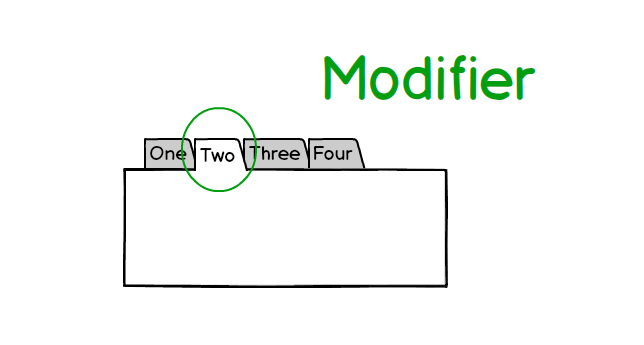
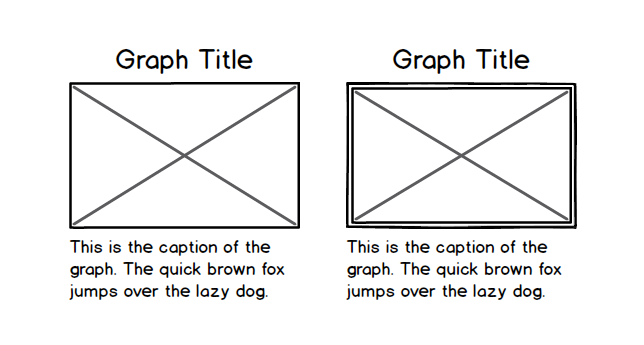
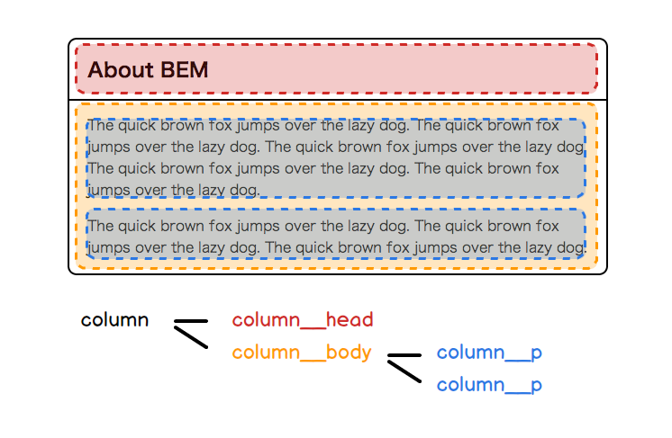
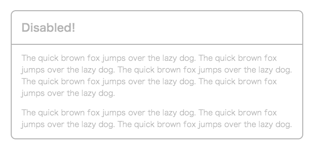
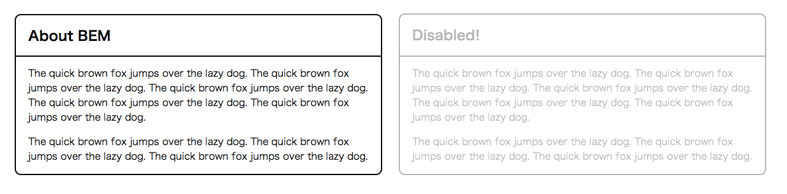

<h1 style="font-size:5em">BEM</h1>

----

## BEMとは

* Yandex
* 設計や実装の方法論のひとつ
* クラス名の命名規則（厳格）
* ツールを含めてBEMと言うこともある

---

<ul class="bigList">
<li><strong>B</strong>lock</li>
<li><strong>E</strong>lement</li>
<li><strong>M</strong>odifier</li>
</ul>

---

### Block

ページを構成するパーツの単位

### Element

Blockを構成するパーツの単位

### Modifier

Block・Elementを変更する追加クラス

----

### Block - Element - Modifier


---


---


---



---



---


---


---


---


----

## BlockとElement

<div class="my-img"></div>

```
<section class="column"> ... </section>
```

---



---

<div class="my-img"></div>

```
<section class="column">
  <h1 class="column__head">About BEM</h1>
  <div class="column__body">
    <p class="column__p">The quick brown...</p>
    <p class="column__p">The quick brown...</p>
  </div>
</section>
```

---

```
.column {
  border:2px solid #000;
  border-radius:10px;
}
  .column__head {
    border-bottom:2px solid #000;
    padding:.8em 20px .7em;
    margin:0;
    font-size:1.4em;
  }
  .column__body {
    padding:1em 20px 0;
  }
    .column__p {
      margin:0;
      padding:0 0 1em;
    }
```

----

## Modifier

<div class="my-img"></div>

```
<section class="column"> ... </section>
```

---

<div class="my-img"></div>

```
<section class="column column_state_disabled"> ... </section>
```

```
.column_state_disabled {
  opacity:.3;
}
```

---

<div class="my-img"></div>

```
<section class="column column_type_caution"> ... </section>
```

```
.column_type_caution {
  background:#EA3B3B;
}
```

---

## Modifierの使いドコロ

* JavaScript等で状態を変化させるとき
* 一つのBlock（かElement）の変化した<br>パターンを作りたいとき

----

## クラス名ルール

* BEM構造を表現するための区切り文字
* 単語の区切りを表すための区切り文字

---

<p style="font-size:1.5em; padding-bottom:.25em"><code>block\_\_element</code></p>

```
<section class="column">
  <h1 class="column__head">About BEM</h1>
  <div class="column__body">
    <p class="column__p">The quick brown...</p>
    <p class="column__p">The quick brown...</p>
  </div>
</section>
```

---

<p style="font-size:1.5em; padding-bottom:.25em"><code>block\_key\_value</code></p>

<div class="my-img"></div>

```
.column {
  opacity: 1;
}
.column_state_disabled {
  opacity: .3;
}
```

---

<p style="font-size:1.5em; padding-bottom:.25em"><code>block\_\_element\_key\_value</code></p>

<div class="my-img"></div>

```
.graph__img {
  border: 2px solid #000;
}
.graph__img_type_important {
  border-color: red;
}
```

---

<p style="font-size:1.5em; padding-bottom:.25em"><code>word-word-word...</code></p>

```
.img-column {
  border:2px solid #000;
  border-radius:10px;
}
  .img-column__img-container {
    float:right;
    padding:0 0 1em 20px;
    width:134px;
  }
```

---

### デメリット

* ややこしい
* クラス名長い

### メリット

* 設計思想／ルールの統一ができる
* クラス名で構造を把握できる

----

## BEMの教え

* Block Element Modifierで考えるべし
* 設計思想を統一すべし
* 命名ルールを統一すべし

そうすればいろいろうまくいく

