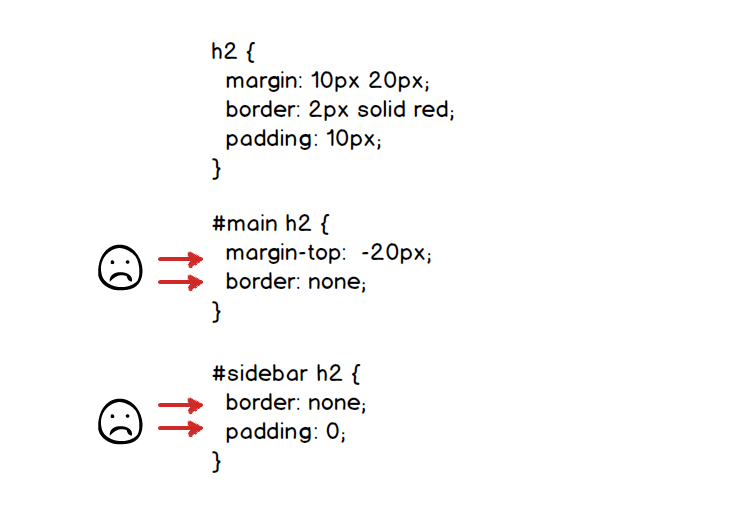
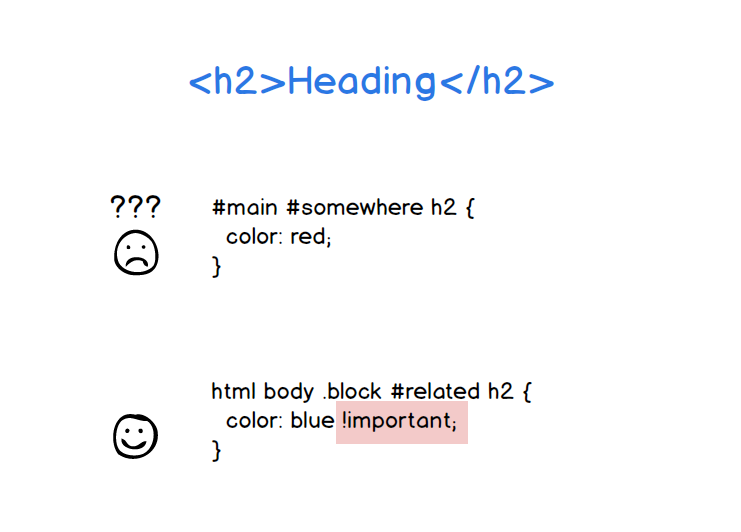
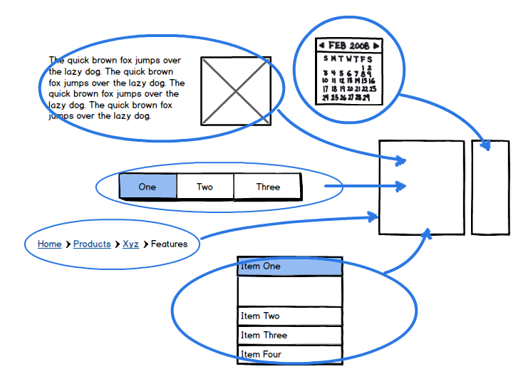
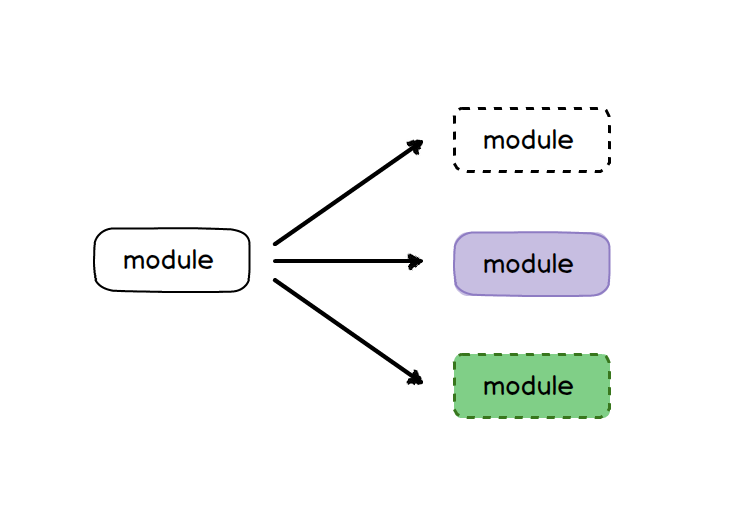
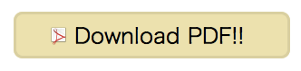

<h1 style="font-size:4em">OOCSS</h1>

----

## OOCSSとは

* Object Oriented CSS
* Nicole Sullivan (Yahoo!)
* オブジェクト指向っぽく考えて整理しよう
* レゴみたいに組み合わせてページをつくろう

----

## こういうのがダメ

---

<div class="my-img"></div>

---

<div class="my-img"></div>

```
#main h2 {
  ...
}
#main .contact .header h2 {
  ...
}
#sidebar h2 {
  ...
}
.somewhere .title h2 {
}
```

場所の名前に依存してスタイルを当てる

----

## なぜダメか？？

---

### 上書き合戦



---

### コピー


---

### 詳細度


---

### `!important`



---


ごちゃごちゃに & 容量増加


----

## レゴみたいに考える

---

<div class="my-img"></div>

---

### 一つ一つの部品に名前をつける

<div class="my-img"></div>

---

```
/* heading module */

.heading {
  prop: val;
}

/* heading2 module */

.heading2 {
  prop: val;
}

/* heading3 module */

.heading3 {
  prop: val;
}
  .heading3 span {
    prop: val;
  }
```

レゴの部品: CSS Object

---

<div class="my-img"></div>

----

## スキン

---

<div class="my-img"></div>

---

* 共通項目を一つのモジュールに定義
* バリエーションをスキンとして定義

プログラムでいう「継承」と近い概念

---

<div class="my-img"></div>

---

<div class="my-img"></div>

```
<span class="button">Button!!</span>
```

```
.button {
  font-size:1.5em;
  padding:.5em 2em .4em;
  border:3px solid #000;
  border-radius:10px;
}
```

---

<div class="my-img"></div>

```
<span class="button caution">Caution!!</span>
```

```
.caution {
  font-weight:bold;
  color:#fff;
  background:#FD3636;
  border-color:#BC2828;
}
```

マルチクラスで実装

---

<div class="my-img"></div>

```
<span class="button pdf">Download PDF!!</span>
```

```
.pdf {
  background:#ECE4AB;
  border-color:#D9D29E;
  padding-left:1.5em;
}
.pdf:before {
  content: '';
  display:inline-block;
  width:22px;
  height:22px;
  background:url(imgs/acrobat.png);
  vertical-align:-2px;
  margin:0 6px 0 0;
}
```

---

<div class="my-img"></div>

```
<span class="button play">Play sound!!</span>
```

```
.play {
  background:#C3E6EA;
  border-color:#AECDD0;
  padding-left:1.5em;
}
.play:before {
  content: '';
  display:inline-block;
  width:22px;
  height:22px;
  background:url(imgs/play.png);
  vertical-align:-2px;
  margin:0 6px 0 0;
}
```

----

## OOCSSの教え

* 行き当たりばったりだと破綻する
* モジュール&スキン
* ページはレゴの組み合わせみたいなものだ
* スケールするサイトには<br>このような設計思想が必要である
