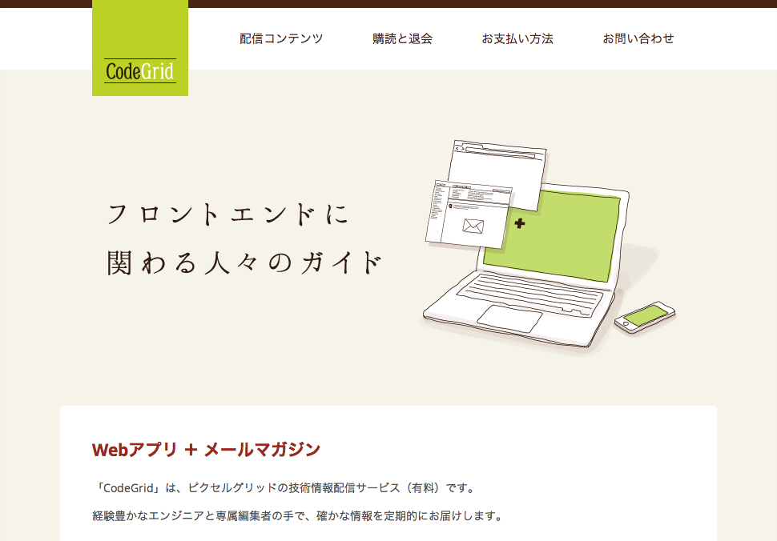
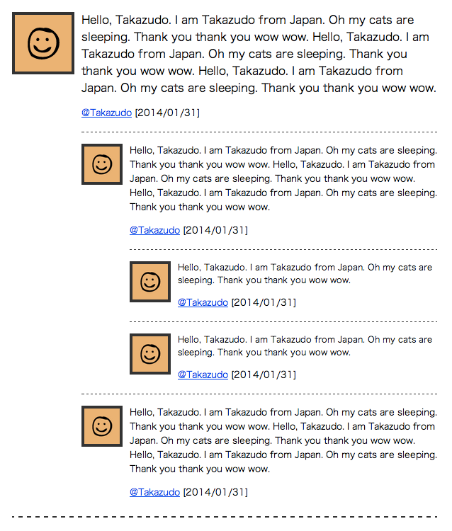
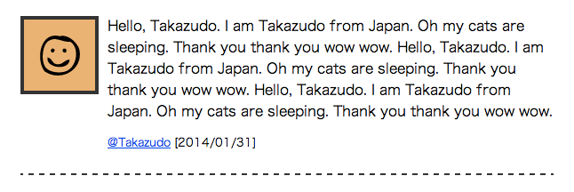
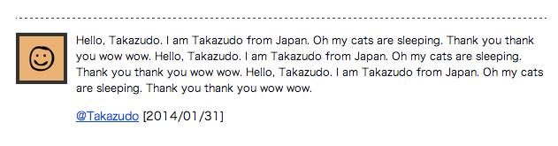
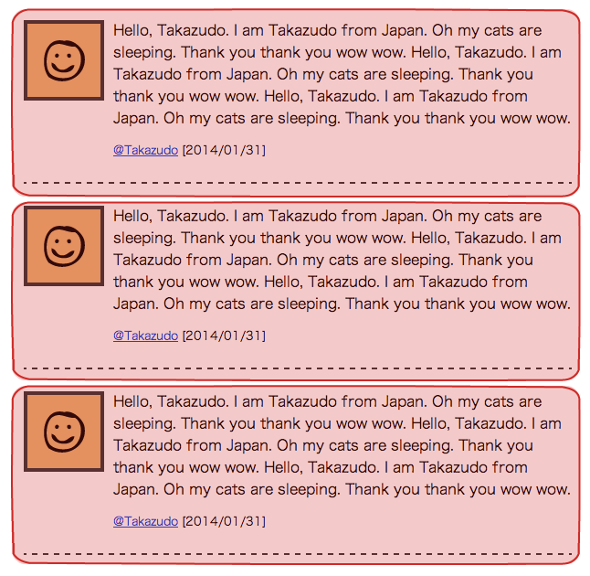
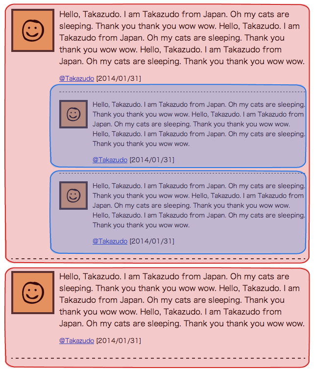
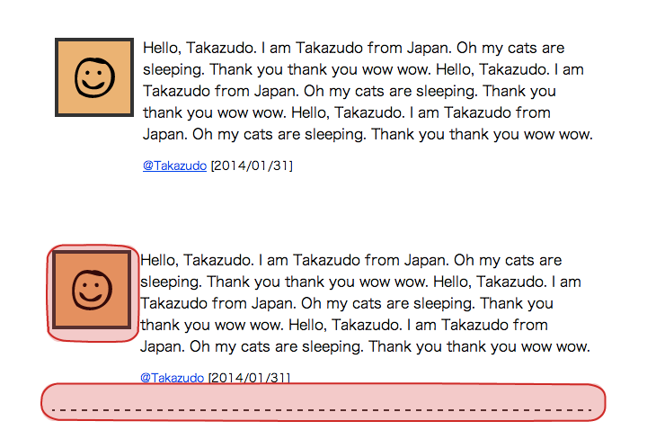
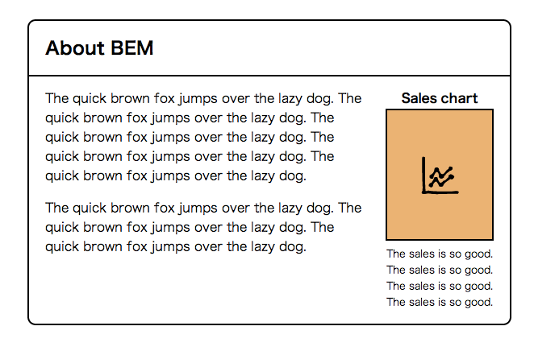

## まとめ

----

* 高速な開発が可能
* プロジェクトの寿命を伸ばせる
* チームによる実装を可能にできる
* コードの再利用を可能にできる

by BEM

----

* あーこの人の考えてること分かるわー<br>と思われるCSSを書こう
* 1ヶ月後の自分は既に他人である
* モジュール一覧とかがあると、なお良い

----

## 宣伝

----



---

## CodeGrid

* ピクセルグリッドの技術情報配信サービス
* フロントエンド周りの情報メイン
* 月額840円
* バックナンバーも全部読める

---

### CSS関する過去配信シリーズ

* CSSの設計
* SassとCSS設計
* BEMによるフロントエンドの設計
* SMACSSによるCSSの設計
* RWDに効くCSSテクニック
* 賢く使うStyleDocco導入ガイド
* 生きたスタイルガイドのためのKSS

などなど

---

## [www.codegrid.net](http://www.codegrid.net)

----

# 以下ボツ

----


---


---



---

<table>
<tr><th>media</th><td></td></tr>
</table>

---

<table>
<tr><th>comment-lv1</th><td></td></tr>
<tr><th>comment-lv2</th><td></td></tr>
<tr><th>comment-lv3</th><td></td></tr>
</table>

---



---



---


---

```
<div class="media">
  <a href="#" class="img"></a>
  <div class="bd">
    <div class="txt">Hello...</div>
    <div class="info"><a href="#">@Takazudo</a> [2014/01/31]</div>
  </div>
</div>
```

```
<div class="media comment-lv1">
  ...
</div>
```

```
<div class="media comment-lv2">
  ...
</div>
```

```
<div class="media comment-lv3">
  ...
</div>
```

---

### media 

<div class="my-img"></div>

---

```
<div class="media">
  <a href="#" class="img"></a>
  <div class="bd">
    <div class="txt">Hello...</div>
    <div class="info"><a href="#">@Takazudo</a> [2014/01/31]</div>
  </div>
</div>
```

```
.media {
}
  .media > .img {
    float:left;
  }
    .media > .img img {
      border:4px solid #333;
    }
  .media > .bd {
    padding-left:10px;
    overflow:hidden;
    *zoom:1; /* ie */
  }
    .media > .bd > .txt{
    }
    .media > .bd > .info{
      font-size:.8em;
      padding:1em 0 0;
    }
```


---

### comment-lv1 

<div class="my-img"></div>

---

```
<div class="media comment-lv1">
  ...
</div>
```

```
.comment-lv1 {
  border-bottom:2px dashed #333;
  padding-bottom:1.5em;
  margin-bottom:1.5em;
}
  .comment-lv1 > .img img {
    width:80px;
    height:80px;
  }
```

---

### comment-lv2 

<div class="my-img"></div>

---

```
<div class="media comment-lv2">
  ...
</div>
```

```
.comment-lv2 {
  margin-top:1em;
  margin-bottom:0;
  padding-top:1em;
  padding-bottom:0;
  border-top:1px dashed #333;
}
  .comment-lv2 > .img img {
    width:50px;
    height:50px;
  }
  .comment-lv2 > .bd > .txt{
    font-size:.8em;
  }
```

---

### comment-lv3 

<div class="my-img"></div>

---

```
<div class="media comment-lv3">
  ...
</div>
```

```
.comment-lv3 {
  margin-top:1em;
  padding-top:1em;
  border-top:1px dashed #333;
}
  .comment-lv3 > .img img {
    width:50px;
    height:50px;
  }
  .comment-lv3 > .bd > .txt{
    font-size:.75em;
  }
```

----

## BEM - Blockの入れ子


---


---


---

<div class="my-img"></div>

```
<section class="img-column">
  <h1 class="img-column__hd">About BEM</h1>
  <div class="img-column__bd">
    <div class="img-column__bd__img-container">
      ここにグラフが入る
    </div>
    <div class="img-column__bd__text">
      <p class="img-column__bd__text__p">The quick brown...</p>
      <p class="img-column__bd__text__p">The quick brown...</p>
    </div>
  </div>
</section>
```

---

<div class="my-img"></div>

```
<div class="graph">
  <div class="graph__hd">Sales chart</div>
  <div class="graph__bd">
    
  </div>
  <div class="graph__ft">The sales is so good...</div>
</div>
```

---

<div class="my-img"></div>

```
<section class="img-column">
  <h1 class="img-column__hd">About BEM</h1>
  <div class="img-column__bd">
    <div class="img-column__bd__img-container">
      <div class="graph">
        <div class="graph__hd">Sales chart</div>
        <div class="graph__bd">
          
        </div>
        <div class="graph__ft">The sales is so good...</div>
      </div>
    </div>
    <div class="img-column__bd__text">
      <p class="img-column__bd__text__p">The quick brown...</p>
      <p class="img-column__bd__text__p">The quick brown...</p>
    </div>
  </div>
</section>
```

---

## Blockの入れ子

* それぞれのBlockを別々につくる
* 別のBlockを入れるElementを用意する
* クラス名で全部スタイル当ててるので<br>崩れたりしない

----

## MindBEMding

* [CSS Wizardry - MindBEMding](htp://csswizardry.com/2013/01/mindbemding-getting-your-head-round-bem-syntax/)
* mind-bending: ショッキングな、ドキッとさせる、<br>圧倒的な、幻覚性の、精神に変調を起こさせる
* もうちょっとだけ単純なやつ
* 心はBEM

---

```
.block {}
.block__element {}
.block--modifier {}
```

```
.site-search {} /* Block */
.site-search__field {} /* Element */
.site-search--full {} /* Modifier */
```

---

```
.person {}
.person__hand {}
.person--female {}
.person--female__hand {}
.person__hand--left {}
```

```
.person {}
.hand {}
.female {}
.female-hand {}
.left-hand {}
```

