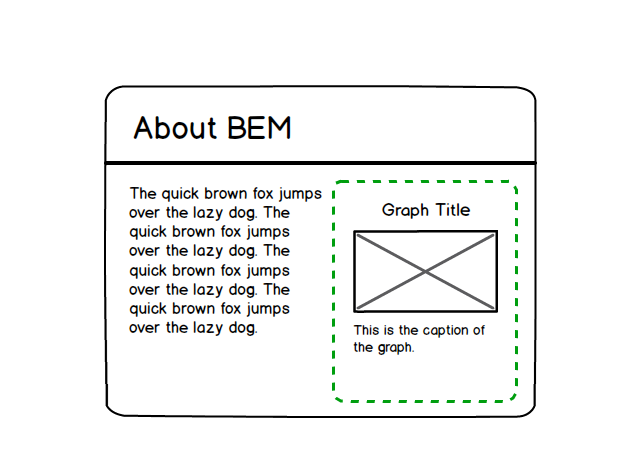
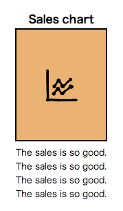

## まとめ

----

* 高速な開発が可能
* プロジェクトの寿命を伸ばせる
* チームによる実装を可能にできる
* コードの再利用を可能にできる

by BEM

----

* あーこの人の考えてること分かるわー<br>と思われるCSSを書こう
* 1ヶ月後の自分は既に他人である
* モジュール一覧とかがあるとなお良い

----

## 宣伝

----


---

## CodeGrid

* ピクセルグリッドの技術情報配信サービス
* フロントエンド周りの情報メイン
* 月額840円
* バックナンバーも全部読める

---

### CSS関する過去配信シリーズ

* CSSの設計
* SassとCSS設計
* BEMによるフロントエンドの設計
* SMACSSによるCSSの設計
* RWDに効くCSSテクニック
* 賢く使うStyleDocco導入ガイド
* 生きたスタイルガイドのためのKSS

などなど

---

## [www.codegrid.net](http://www.codegrid.net)

----

# 以下ボツ

----

## BEM - Blockの入れ子


---


---



---

<div class="my-img"></div>

```
<section class="img-column">
  <h1 class="img-column__hd">About BEM</h1>
  <div class="img-column__bd">
    <div class="img-column__bd__img-container">
      ここにグラフが入る
    </div>
    <div class="img-column__bd__text">
      <p class="img-column__bd__text__p">The quick brown...</p>
      <p class="img-column__bd__text__p">The quick brown...</p>
    </div>
  </div>
</section>
```

---

<div class="my-img"></div>

```
<div class="graph">
  <div class="graph__hd">Sales chart</div>
  <div class="graph__bd">
    
  </div>
  <div class="graph__ft">The sales is so good...</div>
</div>
```

---

<div class="my-img"></div>

```
<section class="img-column">
  <h1 class="img-column__hd">About BEM</h1>
  <div class="img-column__bd">
    <div class="img-column__bd__img-container">
      <div class="graph">
        <div class="graph__hd">Sales chart</div>
        <div class="graph__bd">
          
        </div>
        <div class="graph__ft">The sales is so good...</div>
      </div>
    </div>
    <div class="img-column__bd__text">
      <p class="img-column__bd__text__p">The quick brown...</p>
      <p class="img-column__bd__text__p">The quick brown...</p>
    </div>
  </div>
</section>
```

---

## Blockの入れ子

* それぞれのBlockを別々につくる
* 別のBlockを入れるElementを用意する
* クラス名で全部スタイル当ててるので<br>崩れたりしない
