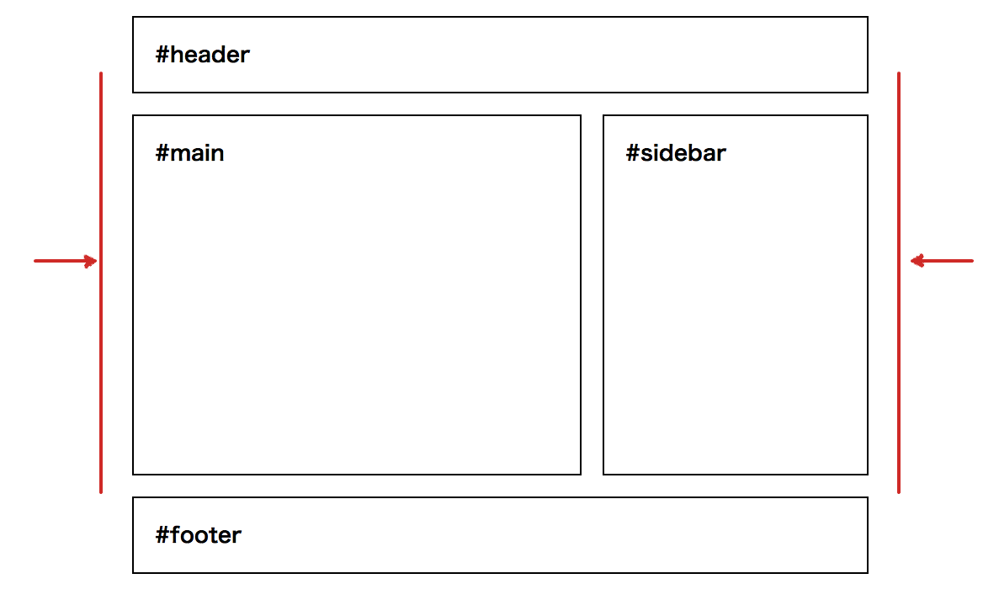

<h1 style="font-size:3.5em">SMACSS</h1>

----

## SMACSSとは

* **S**calable and **M**odular **A**rchitecture for **CSS**
* スケールできてモジュールなCSS設計
* Jonathan Snookがオススメする設計方法
* カッチリした決まりというわけではない

----

### SMACSSの考え方

CSSルールを次の5つに分けて考える

* **Base** - ベースルール
* **Layout** - レイアウトルール
* **Module** - モジュールルール
* **State** - 状態（ステート）ルール
* **Theme** - テーマ

※テーマについては今回は省略

---

<div class="my-img"></div>

----

### Base - ベースルール

サイトのデフォルトスタイルを定義する

* Reset CSS / Normalize.css
* ＋ベースとしたいスタイル

---

#### Eric Meyer Reset CSS

<p style="margin-top:-.5em">http://meyerweb.com/eric/tools/css/reset/</p>

```
/* http://meyerweb.com/eric/tools/css/reset/ 
   v2.0 | 20110126
   License: none (public domain)
*/

html, body, div, span, applet, object, iframe,
h1, h2, h3, h4, h5, h6, p, blockquote, pre,
a, abbr, acronym, address, big, cite, code,
del, dfn, em, img, ins, kbd, q, s, samp,
small, strike, strong, sub, sup, tt, var,
b, u, i, center,
dl, dt, dd, ol, ul, li,
fieldset, form, label, legend,
table, caption, tbody, tfoot, thead, tr, th, td,
article, aside, canvas, details, embed, 
figure, figcaption, footer, header, hgroup, 
menu, nav, output, ruby, section, summary,
time, mark, audio, video {
    margin: 0;
    padding: 0;
    border: 0;
    font-size: 100%;
    font: inherit;
    vertical-align: baseline;
}
/* HTML5 display-role reset for older browsers */
article, aside, details, figcaption, figure, 
footer, header, hgroup, menu, nav, section {
    display: block;
}
body {
    line-height: 1;
}
ol, ul {
    list-style: none;
}
blockquote, q {
    quotes: none;
}
blockquote:before, blockquote:after,
q:before, q:after {
    content: '';
    content: none;
}
table {
    border-collapse: collapse;
    border-spacing: 0;
}
```

---

#### Normalize.css

<p style="margin-top:-.5em">http://necolas.github.io/normalize.css/</p>

```
/*! normalize.css v3.0.0 | MIT License | git.io/normalize */

/**
 * Remove default margin.
 */

body {
  margin: 0;
}

/* HTML5 display definitions
   ========================================================================== */

/**
 * Correct `block` display not defined in IE 8/9.
 */

article,
aside,
details,
figcaption,
figure,
footer,
header,
hgroup,
main,
nav,
section,
summary {
  display: block;
}

/**
 * 1. Correct `inline-block` display not defined in IE 8/9.
 * 2. Normalize vertical alignment of `progress` in Chrome, Firefox, and Opera.
 */

audio,
canvas,
progress,
video {
  display: inline-block; /* 1 */
  vertical-align: baseline; /* 2 */
}

/**
 * Prevent modern browsers from displaying `audio` without controls.
 * Remove excess height in iOS 5 devices.
 */

audio:not([controls]) {
  display: none;
  height: 0;
}

/**
 * Address `[hidden]` styling not present in IE 8/9.
 * Hide the `template` element in IE, Safari, and Firefox < 22.
 */

[hidden],
template {
  display: none;
}

/* Links
   ========================================================================== */

/**
 * Remove the gray background color from active links in IE 10.
 */

a {
  background: transparent;
}

/**
 * Improve readability when focused and also mouse hovered in all browsers.
 */

a:active,
a:hover {
  outline: 0;
}

...
```

---

### ＋ベースとしたいスタイル

```
a { color: #00e; }
a:visited { color: #551a8b; }
a:hover { color: #06e; }
a:focus { outline: thin dotted; }

p {
  padding:0;
  margin:0 0 2em;
}

table {
  border-left: 1px solid #000;
  border-top: 1px solid #000;
}
th, td {
  border-right: 1px solid #000;
  border-bottom: 1px solid #000;
}

...
```

----

### Layout - レイアウトルール

* サイトレイアウトの枠組み
* およびそれを調節するための仕組み
* 段組
* `layout-XXXXX`
* `l-XXXXX`

---

<div class="my-img"></div>

---

```
<div id="all">
  <header id="header"> ... </header>
  <div id="body">
    <div id="sidebar"> ... </div>
    <main id="main"> ... </main>
  </div>
  <footer id="footer"> ... </footer>
</div>
```

---

<div class="my-img"></div>

---

```
<html class="l-flipped">
```

```
.l-flipped #sidebar {
  float: left;
  margin: 0 20px 0 0;
}
```

---

<div class="my-img"></div>

---

```
<html class="l-fixed">
```

```
.l-fixed #all {
  max-width:700px;
}
```

---

<div class="my-img"></div>

---

```
<div class="l-grid">
  <div class="l-grid-item"> ... </div>
  <div class="l-grid-item"> ... </div>
  <div class="l-grid-item"> ... </div>
</div>
```

```
.l-grid {
  ...
}
  .l-grid-item {
    ...
  }
```

----

### Module - モジュールルール

* レイアウトの中にモジュールを入れていく
* OOCSS、BEMで解説したことと同じ

---

<div class="my-img"></div>

---

<div class="my-img"></div>

```
<section class="column">
  <h1 class="column-head">About SMACSS</h1>
  <div class="column-body">
    <p>The quick brown...</p>
    <p>The quick brown...</p>
  </div>
</section>
```

---

```
.column {
  border:2px solid #000;
  border-radius:10px;
}
  .column-head {
    border-bottom:2px solid #000;
    padding:.8em 20px .7em;
    margin:0;
    font-size:1.4em;
  }
  .column-body {
    padding:1em 20px 0;
  }
    .column-body > p {
      margin:0;
      padding:0 0 1em;
    }
```

---

### サブクラス

<div class="my-img"></div>

```
<span class="button">Button!!</span>
<span class="button button-caution">Caution!!</span>
<span class="button button-pdf">Download PDF!!</span>
```

* OOCSSの「スキン」は、<br>SMACSSでは「サブクラス」
* 実装方法もマルチクラス利用で同じ

----

### State - 状態(ステート)ルール

* BEMのModifierと同じ

---

<div class="my-img"></div>

```
<section class="column is-disabled"> ... </section>
```

```
.column.is-disabled {
  opacity:.3;
}
```

追加クラスで状態を表現

----

## SMACCSの教え

* Baseを作り
* Layoutを作り
* Moduleを積んでいけ
* バリエーションはサブクラスで
* 状態の変化はStateで

そう考えて設計するとうまくいくよ

----


<p style="margin-top:-.5em">**[http://smacss.com/](http://smacss.com/)**</p>
<p style="margin-top:-.5em">日本語版もあります</p>
